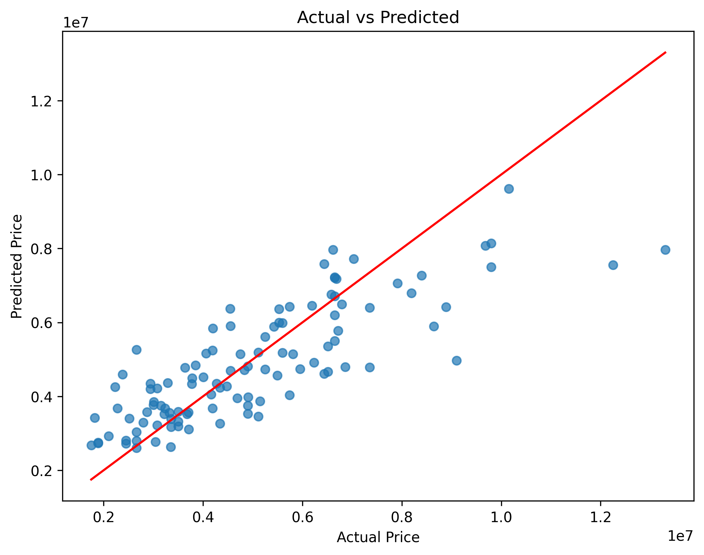
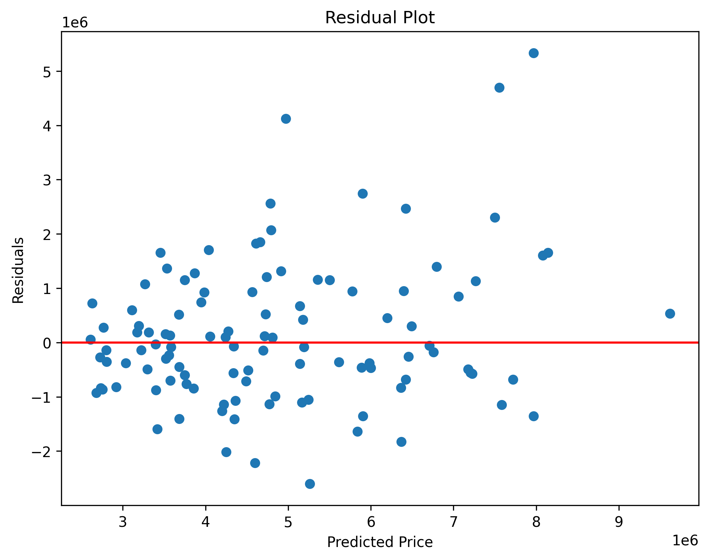

# ElevateLabs-Task3
# 🏠 House Price Prediction using Multiple Linear Regression


---

## 📌 Project Overview

This project implements **Multiple Linear Regression** to predict house prices using various property features such as area, number of bedrooms, bathrooms, parking spaces, furnishing status, and more.

The objective is to understand how multiple independent variables collectively influence house prices and to evaluate the effectiveness of a regression model using industry-standard evaluation metrics.

---

## 🎯 Objectives

* Perform data preprocessing and feature encoding
* Train a Multiple Linear Regression model
* Predict house prices using multiple features
* Evaluate model performance using regression metrics
* Analyze feature importance through model coefficients
* Visualize prediction performance and residuals

---

## 🛠️ Tech Stack

| Tool         | Purpose              |
| ------------ | -------------------- |
| Python       | Programming Language |
| Pandas       | Data Manipulation    |
| NumPy        | Numerical Computing  |
| Matplotlib   | Data Visualization   |
| Scikit-Learn | Machine Learning     |

---

## 📂 Dataset

### Housing Price Dataset

The dataset contains information about residential properties, including:

* Area
* Bedrooms
* Bathrooms
* Stories
* Parking
* Main Road Access
* Guest Room
* Basement
* Air Conditioning
* Preferred Area
* Furnishing Status
* House Price

Target Variable:

```text
Price
```

Features:

```text
All remaining property attributes
```

---

## 🔍 Project Workflow

### 1️⃣ Data Loading

The housing dataset was imported using Pandas and inspected for structure and quality.

```python
df = pd.read_csv("datasets/Housing.csv")
```

---

### 2️⃣ Data Preprocessing

Categorical features were converted into numerical representations using One-Hot Encoding.

```python
df = pd.get_dummies(
    df,
    drop_first=True
)
```

This ensures that all features are suitable for machine learning algorithms.

---

### 3️⃣ Feature Selection

Target Variable:

```python
y = df["price"]
```

Feature Matrix:

```python
X = df.drop("price", axis=1)
```

---

### 4️⃣ Train-Test Split

The dataset was divided into:

* 80% Training Data
* 20% Testing Data

```python
train_test_split(
    X,
    y,
    test_size=0.2,
    random_state=42
)
```

---

### 5️⃣ Model Training

A Multiple Linear Regression model was trained using Scikit-Learn.

```python
from sklearn.linear_model import LinearRegression

model = LinearRegression()

model.fit(
    X_train,
    y_train
)
```

---

### 6️⃣ Predictions

The trained model was used to predict house prices on unseen test data.

```python
y_pred = model.predict(X_test)
```

---

## 📊 Model Evaluation

The model was evaluated using three standard regression metrics.

### Mean Absolute Error (MAE)

Measures the average prediction error.

**Result**

```text
970,043
```

Interpretation:

> On average, the model's predictions differ from actual house prices by approximately ₹9.7 lakh.

---

### Mean Squared Error (MSE)

Measures the average squared prediction error.

**Result**

```text
1.75 × 10¹²
```

---

### R² Score

Measures how much variation in house prices is explained by the model.

**Result**

```text
0.653
```

Interpretation:

> The model explains approximately **65.3% of the variance** in house prices, indicating a reasonably strong predictive capability.

---

## 📈 Visualizations

### Actual vs Predicted Prices

This visualization compares actual house prices with model predictions.



**Observation**

* Most points are close to the ideal prediction line.
* The model captures the general pricing trend effectively.

---

### Residual Plot

Residuals represent prediction errors.



**Observation**

* Residuals are distributed around zero.
* No major systematic pattern is visible.
* Indicates that the model captures most underlying trends reasonably well.

---

## 📋 Feature Importance Analysis

Model coefficients were analyzed to understand how different features influence house prices.

Examples of influential features:

* Bathrooms
* Air Conditioning
* Preferred Area
* Stories
* Parking Availability

Positive coefficients indicate that increasing the feature generally increases the predicted house price.

The complete coefficient analysis is available in:

```text
coefficients.csv
```

---

## 📁 Project Structure

```text
ElevateLabs-Task3/
│
├── datasets/
│   └── Housing.csv
│
├── images/
│   ├── actual_vs_predicted.png
│   └── residual_plot.png
│
├── coefficients.csv
├── metrics.csv
│
├── linear_regression.ipynb
│
└── README.md
```

---

## 🚀 Getting Started

### Clone the Repository

```bash
git clone https://github.com/PushkarAgrawal17/ElevateLabs-Task3.git
```

### Navigate to the Project Directory

```bash
cd ElevateLabs-Task3
```

### Install Dependencies

```bash
pip install pandas numpy matplotlib scikit-learn
```

### Run the Notebook

```bash
jupyter notebook
```

Open:

```text
linear_regression.ipynb
```

---

## 📈 Results & Insights

### Key Findings

* House prices are influenced by multiple factors rather than a single feature.
* Bathrooms, area, parking, and furnishing status significantly impact price.
* Multiple Linear Regression performs substantially better than using area alone.
* The model achieved an R² score of approximately 65%, demonstrating reasonable predictive performance.

---

## 🎓 Learning Outcomes

Through this project, I learned:

* Multiple Linear Regression fundamentals
* Feature encoding techniques
* Train-Test splitting
* Regression evaluation metrics (MAE, MSE, R²)
* Residual analysis
* Feature importance interpretation
* Building complete machine learning workflows

---

## 🔮 Future Improvements

* Feature scaling and normalization
* Feature selection techniques
* Regularization (Ridge & Lasso Regression)
* Hyperparameter optimization
* Comparison with advanced regression models

---

## 👨‍💻 Author

**Pushkar Agrawal**

B.Tech CSE Student | Machine Learning Enthusiast | AI Learner
